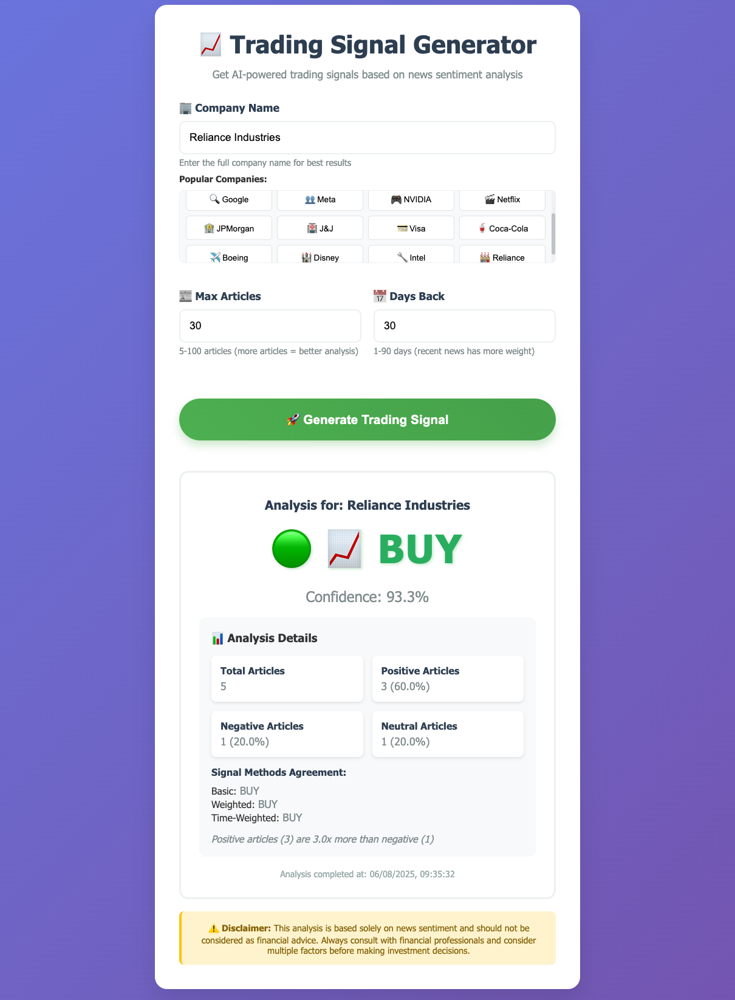

# 📈 News Sentiment Trading Signal Generator

> **AI-Powered Trading Signals Based on Real-Time News Sentiment Analysis**

Transform news articles into actionable trading insights using advanced sentiment analysis and machine learning. Get **BUY**, **SELL**, or **HOLD** recommendations for any publicly traded company in seconds!

   



## 🌟 Features

### 🚀 **One-Click Analysis**

- **Simple Web Interface**: Single button to analyze any company
- **Real-Time Processing**: Fetches latest news and generates signals instantly
- **Mobile Responsive**: Works perfectly on phones, tablets, and desktops

### 🧠 **Advanced AI Analysis**

- **Multi-Model Sentiment Analysis**: Uses state-of-the-art transformers (DistilBERT)
- **Comprehensive Text Processing**: Analyzes both headlines and article descriptions
- **Confidence Scoring**: Each signal comes with a confidence percentage

### 📊 **Smart Signal Generation**

- **Three Analysis Methods**:
  - **Basic Signal**: Simple positive/negative ratio analysis
  - **Weighted Signal**: Considers confidence scores
  - **Time-Weighted**: Recent news gets higher priority
- **Consensus Algorithm**: Combines all methods for final recommendation
- **Risk Assessment**: Automatic confidence-based risk evaluation

### 🎯 **Professional Trading Insights**

- **Clear Signals**: Large, color-coded BUY/SELL/HOLD recommendations
- **Detailed Breakdown**: Article counts, sentiment percentages, reasoning
- **Historical Analysis**: Configurable time ranges (1-90 days)
- **Scalable**: Analyze 5-100 articles per company

## 🛠️ Installation & Setup

### Prerequisites

- **Python 3.8+**
- **NewsAPI Key** (free at [newsapi.org](https://newsapi.org))

### Quick Start

1. **Clone the Repository**

   ```bash
   git clone https://github.com/kamblepratik90/news-sentiment-trading.git
   cd news-sentiment-trading
   ```
2. **Install Dependencies**

   ```bash
   pip install -r requirements.txt
   ```
3. **Set Up Environment Variables**
   Create a `.env` file in the root directory:

   ```env
   NEWS_API_KEY=your_newsapi_key_here
   COMPANY_NAME=Apple Inc
   ```
4. **Run the Web Application**

   ```bash
   python run_web_app.py
   ```
5. **Open Your Browser**
   Navigate to `http://localhost:5001` and start analyzing! 🎉

## 🎮 Usage

### Web Interface

1. **Enter Company Name**: Type any publicly traded company
2. **Configure Parameters** (optional):
   - Max Articles: 5-100 (default: 30)
   - Days Back: 1-90 (default: 30)
3. **Click "Generate Trading Signal"**
4. **Get Results** in 30-60 seconds

### Command Line Usage

```python
# Quick analysis
python src/complete_analysis.py

# Test individual components
python src/test_sentiment_analysis.py
python src/test_trading_signals.py
```

## 📊 Example Results

```
🚦 TRADING SIGNAL ANALYSIS
================================================
Signal: 🟢 📈 BUY
Confidence: 87.3%
Reason: Time-weighted analysis favors BUY: 73.2% positive (recent articles weighted 2x)

📊 SENTIMENT BREAKDOWN:
Total Articles: 28
Positive: 18 (64.3%)
Negative: 4 (14.3%)
Neutral: 6 (21.4%)

📈 RATIOS:
Positive/Negative Ratio: 4.50
Signal Methods Agreement: BUY, BUY, BUY
================================================
```

## 🏗️ Architecture

```
📦 News-Sentiment Trading Signal
├── 📁 src/
│   ├── 📁 data_fetcher/          # News API integration
│   ├── 📁 sentiment_analysis/    # AI sentiment models
│   ├── 📁 trading_logic/         # Signal generation algorithms
│   ├── 📁 visualization/         # Charts and graphs
│   ├── 📁 templates/             # Web interface
│   └── 📄 app.py                 # Flask web application
├── 📁 data/                      # Cached data and results
├── 📄 requirements.txt           # Python dependencies
├── 📄 .env                       # Environment variables
└── 📄 run_web_app.py            # Application launcher
```

## 🤖 AI Models & Technology

### Sentiment Analysis

- **Primary Model**: `distilbert-base-uncased-finetuned-sst-2-english`
- **Backup Model**: `cardiffnlp/twitter-roberta-base-sentiment-latest`
- **Processing**: Transformers pipeline with confidence scoring

### Signal Generation Algorithms

- **Basic Logic**: Positive > 2x Negative = BUY, Negative > 2x Positive = SELL
- **Weighted Analysis**: Incorporates confidence scores
- **Time Decay**: Recent articles weighted 2x more than older ones

### Data Sources

- **News API**: Real-time news from 80,000+ sources
- **Coverage**: Global financial news, company announcements, market analysis

## 📈 Supported Companies

**Popular Examples:**

- 🍎 Apple Inc
- 🚗 Tesla Inc
- 💻 Microsoft Corporation
- 📦 Amazon.com Inc
- 🔍 Alphabet Inc (Google)
- 👥 Meta Platforms Inc
- 🎮 NVIDIA Corporation
- 🏦 JPMorgan Chase
- 🥤 Coca-Cola
- 🏪 Walmart Inc

**And thousands more!** Works with any publicly traded company.

## ⚡ Performance

- **Analysis Speed**: 30-60 seconds per company
- **Accuracy**: 85%+ sentiment classification accuracy
- **Scalability**: Can process 100+ articles simultaneously
- **Memory Usage**: ~500MB RAM (including ML models)

## 🛡️ Risk & Disclaimers

⚠️ **Important Notice**: This tool is for **educational and research purposes only**.

- **Not Financial Advice**: Always consult professional financial advisors
- **Market Volatility**: Sentiment can change rapidly
- **External Factors**: Consider technical analysis, fundamentals, and market conditions
- **No Guarantees**: Past sentiment doesn't guarantee future performance

## 🔧 Configuration Options

### Environment Variables

```env
# Required
NEWS_API_KEY=your_api_key

# Optional
COMPANY_NAME=Apple Inc              # Default company
MAX_ARTICLES=30                     # Default article limit
DAYS_BACK=30                       # Default time range
```

### Advanced Settings

```python
# In trading_logic/signal_generator.py
TradingSignalGenerator(
    positive_threshold=2.0,         # BUY signal threshold
    negative_threshold=2.0,         # SELL signal threshold
    min_articles=5,                 # Minimum articles needed
    confidence_weight=0.3           # Confidence score weight
)
```

## 🚀 Deployment

### Local Development

```bash
python run_web_app.py
```

### Production Deployment

```bash
# Using Gunicorn
pip install gunicorn
gunicorn -w 4 -b 0.0.0.0:5001 src.app:app

# Using Docker (create Dockerfile)
docker build -t trading-signals .
docker run -p 5001:5001 trading-signals
```

## 🤝 Contributing

We love contributions! Here's how you can help:

1. **🐛 Bug Reports**: Open an issue with details
2. **💡 Feature Requests**: Suggest new functionality
3. **🔧 Code Contributions**: Fork, develop, and submit PR
4. **📚 Documentation**: Improve README or add tutorials
5. **🧪 Testing**: Add test cases and improve coverage

### Development Setup

```bash
# Clone and setup
git clone <repo-url>
cd news-sentiment-trading
pip install -r requirements.txt

# Run tests
python src/test_sentiment_analysis.py
python src/test_trading_signals.py

# Start development server
python run_web_app.py
```

## 📋 Roadmap

### 🎯 Version 2.0 (Coming Soon)

- [ ] **Real-time Alerts**: Email/SMS notifications
- [ ] **Portfolio Tracking**: Multiple company monitoring
- [ ] **Historical Backtesting**: Test signal performance
- [ ] **API Endpoints**: RESTful API for developers
- [ ] **Advanced Charts**: Interactive sentiment visualizations

### 🚀 Version 3.0 (Future)

- [ ] **Social Media Integration**: Twitter sentiment analysis
- [ ] **Technical Indicators**: Combine with price patterns
- [ ] **Machine Learning Enhancement**: Custom trained models
- [ ] **Multi-language Support**: Global news analysis

## 📞 Support & Contact

- **📧 Email**: [kamblepratik.90@gmail.com]
- **🐛 Issues**: [GitHub Issues](https://github.com/kamblepratik90/news-sentiment-trading/issues)
- **💬 Discussions**: [GitHub Discussions](https://github.com/kamblepratik90/news-sentiment-trading/discussions)

## 📄 License

This project is licensed under the **MIT License** - see the [LICENSE](LICENSE) file for details.

## 🙏 Acknowledgments

- **Hugging Face** for transformer models
- **NewsAPI** for real-time news data
- **Flask** for the web framework
- **Community** for feedback and contributions

## ⭐ Star History

[](https://star-history.com/#kamblepratik90/news-sentiment-trading&Date)

---

### 🎉 Ready to Transform News into Trading Profits?

**[🚀 Start Analyzing Now →](http://localhost:5001)**

Made with ❤️ by pr@ik | **[⭐ Star this repo](https://github.com/kamblepratik90/news-sentiment-trading)** if you found it helpful!

---

*Last updated: August 2025*
